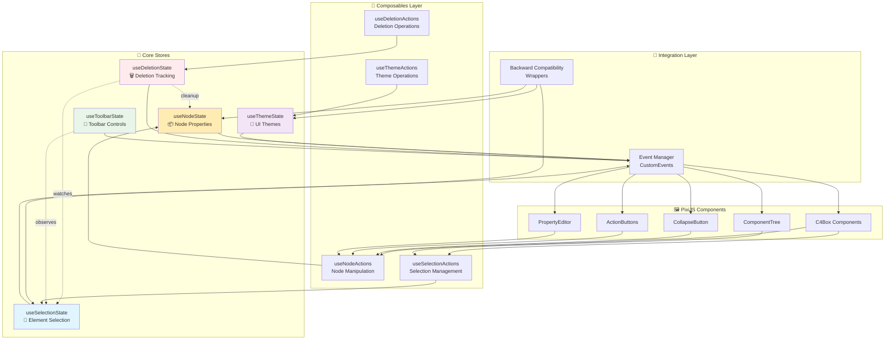
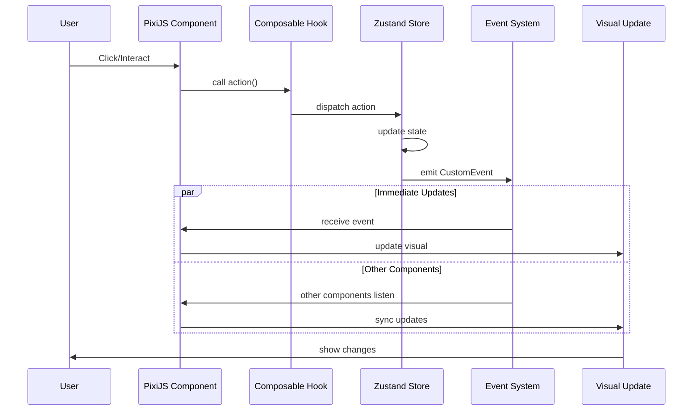

# 🏪 State Management Documentation

> **⚠️ MANDATORY**: อ่านเอกสารนี้ก่อนแก้ไขหรือเพิ่ม state logic ทุกครั้ง

## 📋 Table of Contents

1. [Overview](#overview)
2. [Architecture](#architecture)
3. [Store Reference](#store-reference)
4. [Composables Reference](#composables-reference)
5. [Integration Patterns](#integration-patterns)
6. [Event System](#event-system)
7. [Usage Examples](#usage-examples)
8. [Troubleshooting](#troubleshooting)
9. [Migration Guide](#migration-guide)

## 🎯 Overview

โปรเจค C4 Editor ใช้ **Function-based State Management** โดยใช้ **Zustand vanilla stores** เป็นแกนหลัก ร่วมกับ **Composable Actions** และ **Event-driven Communication**

### ✨ Key Benefits

- 🚀 **Performance**: Tree-shaking และ reduced bundle size
- 🧩 **Modularity**: แยก concerns ชัดเจน easy to maintain
- 🔄 **Reactive**: Auto-sync ระหว่าง components ผ่าน events
- 🔙 **Backward Compatible**: รองรับโค้ดเก่าผ่าน compatibility wrappers
- 🧪 **Testable**: Pure functions ทดสอบง่าย

## 🏗️ Architecture



### 📊 State Flow


## 🏪 Store Reference

### 📦 useNodeState

**Purpose**: จัดการ properties และ behavior ของ C4 nodes

#### State Structure
```typescript
interface NodeState {
  isCollapsed: boolean;           // สถานะการ collapse/expand
  isEditing: boolean;            // สถานะการแก้ไข
  properties: Map<string, PropertyValue>; // Properties ของ node
  actionButtonsVisible: boolean;  // การแสดง action buttons
  originalBounds?: { width: number; height: number };
  collapsedBounds?: { width: number; height: number };
}
```

#### Key Actions
- `initializeNodeState(nodeId, initialState?)` - เริ่มต้น node state
- `setCollapsed(nodeId, collapsed)` - collapse/expand node
- `setEditing(nodeId, editing)` - เข้า/ออก edit mode
- `addProperty(nodeId, property)` - เพิ่ม property
- `removeProperty(nodeId, key)` - ลบ property
- `removeNodeState(nodeId)` - ลบ state ทั้งหมด

#### Events Emitted
- `node-state-changed` - เมื่อมีการเปลี่ยนแปลง state

<details>
<summary>📝 Node State Usage Example</summary>

```typescript
// ใช้ store โดยตรง
import { useNodeState } from '../stores';

const nodeState = useNodeState.getState();
nodeState.initializeNodeState('node-1');
nodeState.setCollapsed('node-1', true);

// หรือใช้ composable (แนะนำ)
import { useNodeActions } from '../composables';

const nodeActions = useNodeActions(container);
nodeActions.collapse();
```
</details>

---

### 🎯 useSelectionState

**Purpose**: จัดการการเลือก elements และ visual indicators

#### State Structure
```typescript
interface SelectionStateStore {
  selectedElements: Map<string, SelectableElement>;
  lastSelectedElement: SelectableElement | null;
  selectionMode: 'single' | 'multiple';
  // ... other selection properties
}
```

#### Key Actions
- `selectElement(element)` - เลือก element
- `deselectElement(element)` - ยกเลิกการเลือก
- `deselectAll()` - ยกเลิกการเลือกทั้งหมด
- `toggleSelection(element)` - toggle การเลือก
- `getSelectedElements()` - ได้ elements ที่เลือก

#### Events Emitted
- `pixi-selection-change` - เมื่อมีการเปลี่ยนแปลงการเลือก
- `selection-cleared` - เมื่อยกเลิกการเลือกทั้งหมด

---

### 🎨 useThemeState

**Purpose**: จัดการ UI themes และ accessibility settings

#### State Structure
```typescript
interface ThemeStateStore {
  currentTheme: ThemeConfig;
  accessibilitySettings: AccessibilitySettings;
  isDarkMode: boolean;
  // ... other theme properties
}
```

#### Key Actions
- `setTheme(themeConfig)` - เปลี่ยน theme
- `toggleDarkMode()` - toggle dark mode
- `updateAccessibility(settings)` - อัปเดต accessibility
- `syncWithBrowserPreferences()` - sync กับ browser

#### Events Emitted
- `theme-changed` - เมื่อเปลี่ยน theme
- `accessibility-changed` - เมื่อเปลี่ยน accessibility settings

---

### 🗑️ useDeletionState

**Purpose**: tracking การลบ elements และ cleanup

#### State Structure
```typescript
interface DeletionStateStore {
  deletingElements: Map<string, boolean>;
  deletionHistory: DeletionRecord[];
  // ... other deletion properties
}
```

#### Key Actions
- `deleteElement(element)` - ลบ element (generic)
- `deleteNode(element)` - ลบ node element
- `deleteEdge(element)` - ลบ edge element
- `isDeleting(nodeId)` - ตรวจสอบสถานะการลบ
- `getDeletionHistory()` - ได้ประวัติการลบ

#### Events Emitted
- `element-deletion-started` - เริ่มการลบ
- `element-deletion-completed` - ลบสำเร็จ
- `element-deletion-failed` - ลบไม่สำเร็จ

---

### 🔧 useToolbarState

**Purpose**: จัดการสถานะของ toolbar buttons

#### State Structure
```typescript
interface ToolbarButtonState {
  visible: boolean;
  enabled: boolean;
  loading: boolean;
  tooltip?: string;
}
```

#### Key Actions
- `showToolbar()` - แสดง toolbar
- `hideToolbar()` - ซ่อน toolbar
- `setButtonLoading(action, loading)` - set loading state
- `handleEditAction()` - จัดการ edit action
- `handleDeleteAction()` - จัดการ delete action

## 🎣 Composables Reference

### 🔧 useNodeActions

**Purpose**: Composable สำหรับจัดการ node operations

```typescript
const nodeActions = useNodeActions(container);

// Available methods
nodeActions.collapse();           // Collapse node
nodeActions.expand();            // Expand node
nodeActions.startEditing();      // เริ่มการแก้ไข
nodeActions.stopEditing();       // หยุดการแก้ไข
nodeActions.addProperty(prop);   // เพิ่ม property
nodeActions.removeProperty(key); // ลบ property
```

### 🎯 useSelectionActions

**Purpose**: Composable สำหรับจัดการ selection operations

```typescript
const selectionActions = useSelectionActions();

// Available methods
selectionActions.select(element);     // เลือก element
selectionActions.deselect(element);   // ยกเลิกการเลือก
selectionActions.toggle(element);     // toggle การเลือก
selectionActions.selectAll();         // เลือกทั้งหมด
selectionActions.deselectAll();       // ยกเลิกทั้งหมด
```

### 🗑️ useDeletionActions

**Purpose**: Composable สำหรับจัดการ deletion operations

```typescript
const deletionActions = useDeletionActions();

// Available methods
await deletionActions.deleteElement(element);    // ลบ element
await deletionActions.deleteMultiple(elements);  // ลบหลาย elements
const canDelete = await deletionActions.canDeleteElement(element);
const isDeleting = await deletionActions.isDeleting(nodeId);
```

## 🔗 Integration Patterns

### Pattern 1: Component with Store Integration

```typescript
// ในไฟล์ component
import { useNodeState } from '../stores';
import { useNodeActions } from '../composables';

class MyComponent {
  constructor(container: Container) {
    // ใช้ composable (แนะนำ)
    const nodeActions = useNodeActions(container);
    
    // หรือใช้ store โดยตรง
    const nodeState = useNodeState.getState();
    
    // Setup event listeners
    this.setupEventListeners();
  }
  
  private setupEventListeners() {
    window.addEventListener('node-state-changed', this.handleNodeStateChange);
  }
  
  private handleNodeStateChange = (event: CustomEvent) => {
    // Handle state changes
  };
}
```

### Pattern 2: Event-driven Communication

```typescript
// Component A: Emit event
const event = new CustomEvent('my-custom-event', {
  detail: { data: 'some data' }
});
window.dispatchEvent(event);

// Component B: Listen for event
window.addEventListener('my-custom-event', (event) => {
  console.log(event.detail.data);
});
```

### Pattern 3: Backward Compatibility

```typescript
// โค้ดเก่า (ยังใช้ได้)
import { nodeStateManager } from '../stores';
nodeStateManager.setCollapsed(container, true);

// โค้ดใหม่ (แนะนำ)
import { useNodeActions } from '../composables';
const nodeActions = useNodeActions(container);
nodeActions.collapse();
```

## 📡 Event System

### Core Events

| Event Name | Description | Detail Structure |
|------------|-------------|------------------|
| `node-state-changed` | Node state เปลี่ยนแปลง | `{ nodeId, changeType, ...details }` |
| `pixi-selection-change` | Selection เปลี่ยนแปลง | `{ container, action }` |
| `selection-cleared` | ยกเลิกการเลือกทั้งหมด | `{}` |
| `theme-changed` | Theme เปลี่ยนแปลง | `{ theme, previousTheme }` |
| `element-deletion-started` | เริ่มการลบ element | `{ element, elementType }` |
| `element-deletion-completed` | ลบ element สำเร็จ | `{ element, elementType }` |
| `element-deletion-failed` | ลบ element ไม่สำเร็จ | `{ element, elementType, error }` |

### Event Flow Example



## 💡 Usage Examples

### Example 1: Creating a New C4 Node

```typescript
import { useNodeActions } from '../composables';
import { makeSelectable } from '../stores/selectionState';

function createNewNode() {
  // 1. Create PixiJS container
  const container = new Container();
  
  // 2. Make it selectable
  const selectableElement = makeSelectable(container, 'node');
  
  // 3. Initialize node state
  const nodeActions = useNodeActions(container);
  
  // 4. Set initial properties
  nodeActions.addProperty({
    key: 'name',
    value: 'New Node',
    type: 'text',
    id: 'prop-1',
    order: 0
  });
  
  return container;
}
```

### Example 2: Handling Selection Changes

```typescript
import { useSelectionActions } from '../composables';

class ComponentTree {
  constructor() {
    this.setupSelectionSync();
  }
  
  private setupSelectionSync() {
    // Listen for selection changes from PixiJS
    window.addEventListener('pixi-selection-change', (event: CustomEvent) => {
      const { container, action } = event.detail;
      
      if (action === 'select') {
        this.highlightTreeNode(container);
      } else if (action === 'deselect') {
        this.unhighlightTreeNode(container);
      }
    });
  }
  
  private handleTreeNodeClick(container: Container) {
    const selectionActions = useSelectionActions();
    selectionActions.toggle(container);
  }
}
```

### Example 3: Theme Integration

```typescript
import { useThemeActions } from '../composables';

class ThemeButton {
  constructor() {
    const themeActions = useThemeActions();
    
    // Toggle dark mode
    this.button.onclick = () => {
      themeActions.toggleDarkMode();
    };
    
    // Listen for theme changes
    window.addEventListener('theme-changed', (event: CustomEvent) => {
      const { theme } = event.detail;
      this.updateButtonAppearance(theme);
    });
  }
}
```

### Example 4: Element Deletion Flow

```typescript
import { useDeletionActions } from '../composables';

class DeleteButton {
  async handleDelete(element: SelectableElement) {
    const deletionActions = useDeletionActions();
    
    // 1. Check permissions
    const permission = await deletionActions.canDeleteElement(element);
    if (!permission.canDelete) {
      alert(`Cannot delete: ${permission.reason}`);
      return;
    }
    
    // 2. Confirm with user
    const confirmed = confirm('Are you sure you want to delete this element?');
    if (!confirmed) return;
    
    // 3. Perform deletion
    try {
      const success = await deletionActions.deleteElement(element);
      if (success) {
        console.log('Element deleted successfully');
      } else {
        throw new Error('Deletion failed');
      }
    } catch (error) {
      console.error('Deletion error:', error);
      alert('Failed to delete element');
    }
  }
}
```

## 🔧 Troubleshooting

### Common Issues

#### Issue 1: State Not Updating

**Problem**: Component ไม่อัปเดตเมื่อ state เปลี่ยน

**Solution**:
```typescript
// ❌ ผิด - ไม่ได้ฟัง events
const nodeState = useNodeState.getState();
console.log(nodeState.isCollapsed('node-1')); // อาจไม่ใช่ค่าล่าสุด

// ✅ ถูก - ฟัง events
window.addEventListener('node-state-changed', (event) => {
  if (event.detail.nodeId === 'node-1') {
    // Update component here
  }
});
```

#### Issue 2: Memory Leaks

**Problem**: Event listeners ไม่ถูก cleanup

**Solution**:
```typescript
class MyComponent {
  private eventCleanups: (() => void)[] = [];
  
  constructor() {
    // Store cleanup functions
    this.eventCleanups.push(
      this.addEventListener('node-state-changed', this.handler)
    );
  }
  
  destroy() {
    // Clean up all event listeners
    this.eventCleanups.forEach(cleanup => cleanup());
  }
  
  private addEventListener(type: string, handler: EventListener) {
    window.addEventListener(type, handler);
    return () => window.removeEventListener(type, handler);
  }
}
```

#### Issue 3: Circular Dependencies

**Problem**: Store A พึ่งพา Store B และ Store B พึ่งพา Store A

**Solution**:
```typescript
// ❌ ผิด - circular dependency
// storeA.ts
import { useBStore } from './storeB';

// storeB.ts  
import { useAStore } from './storeA';

// ✅ ถูก - ใช้ events แทน
// storeA.ts
window.dispatchEvent(new CustomEvent('store-a-changed', { detail }));

// storeB.ts
window.addEventListener('store-a-changed', (event) => {
  // Handle change
});
```

### Debugging Tips

1. **Use Browser DevTools**: เปิด console เพื่อดู event flows
2. **Add Logging**: เพิ่ม console.log ใน store actions
3. **Check Event Listeners**: ใช้ `getEventListeners(window)` ใน DevTools
4. **Validate State**: ใช้ `store.getState()` เพื่อดูสถานะปัจจุบัน

### Performance Tips

1. **Use Composables**: หลีกเลี่ยงการเข้าถึง store โดยตรงใน components
2. **Batch Updates**: รวม state changes ที่เกี่ยวข้องกัน
3. **Clean Up Events**: ลบ event listeners เมื่อไม่ใช้แล้ว
4. **Debounce Frequent Updates**: ใช้ debounce สำหรับ events ที่เกิดบ่อย

## 🔄 Migration Guide

### From Class-based to Function-based

#### Before (Class-based)
```typescript
import { NodeStateManager } from '../managers/NodeStateManager';

const nodeManager = NodeStateManager.getInstance();
nodeManager.setCollapsed(container, true);
nodeManager.addProperty(container, property);
```

#### After (Function-based)
```typescript
import { useNodeActions } from '../composables';

const nodeActions = useNodeActions(container);
nodeActions.collapse();
nodeActions.addProperty(property);
```

### Gradual Migration Strategy

1. **Keep existing code working** - ใช้ compatibility wrappers
2. **New features use function-based** - เพิ่มฟีเจอร์ใหม่ด้วย composables
3. **Refactor gradually** - ค่อยๆ แปลงโค้ดเก่าตามความสะดวก
4. **Test thoroughly** - ทดสอบให้แน่ใจว่าทำงานถูกต้อง

### Compatibility Wrappers

โปรเจคมี wrappers สำหรับรองรับโค้ดเก่า:

```typescript
// เหล่านี้ยังใช้ได้ปกติ
import { nodeStateManager, selectionManager, themeManager } from '../stores';

nodeStateManager.setCollapsed(container, true);
selectionManager.selectElement(element);
themeManager.setTheme(config);
```

## 📚 Further Reading

- [Zustand Documentation](https://github.com/pmndrs/zustand)
- [Function-based Architecture Benefits](../CLAUDE.md#function-based-architecture)
- [Event-driven Patterns](../CLAUDE.md#event-handling)
- [Testing Guide](../test/functionBasedArchitecture.test.ts)

---

## 🆘 Need Help?

1. **Check this documentation first** 📖
2. **Search existing issues** in the codebase
3. **Add logging** to understand the flow
4. **Test with simple examples** ก่อนใช้ในโปรเจคจริง
5. **Ask for help** พร้อมกับข้อมูลที่เกี่ยวข้อง

---

*📝 Document Version: 1.0 | Last Updated: [Date] | Status: ✅ Active*