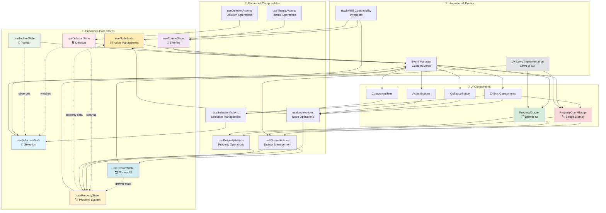
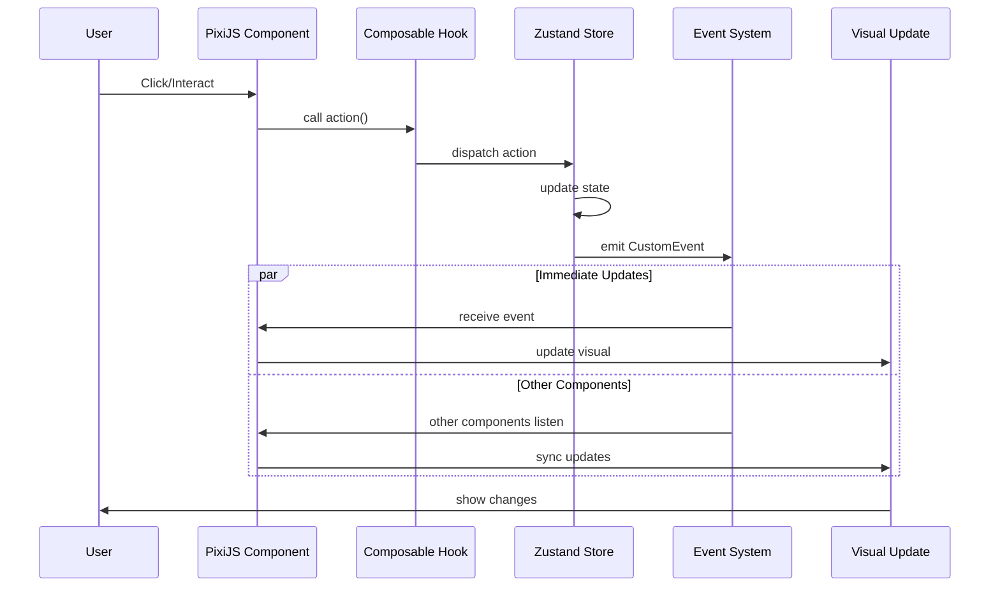

# 🏪 Enhanced State Management Documentation

> **⚠️ MANDATORY**: อ่านเอกสารนี้ก่อนแก้ไขหรือเพิ่ม state logic ทุกครั้ง

## 📋 Table of Contents

1. [Overview](#overview)
2. [Enhanced Architecture](#enhanced-architecture)
3. [Property State System](#property-state-system)
4. [Drawer State System](#drawer-state-system)
5. [Store Reference](#store-reference)
6. [Composables Reference](#composables-reference)
7. [UI Components](#ui-components)
8. [Integration Patterns](#integration-patterns)
9. [Event System](#event-system)
10. [Usage Examples](#usage-examples)
11. [UX Guidelines](#ux-guidelines)
12. [Troubleshooting](#troubleshooting)
13. [Migration Guide](#migration-guide)

## 🎯 Overview

โปรเจค C4 Editor ใช้ **Enhanced Function-based State Management** โดยใช้ **Zustand vanilla stores** เป็นแกนหลัก ร่วมกับ **Advanced Property System**, **Drawer UI Management** และ **Event-driven Communication**

### ✨ Key Benefits (Enhanced)

- 🚀 **Performance**: Tree-shaking และ reduced bundle size
- 🧩 **Modularity**: แยก concerns ชัดเจน easy to maintain
- 🔄 **Reactive**: Auto-sync ระหว่าง components ผ่าน events
- 🔙 **Backward Compatible**: รองรับโค้ดเก่าผ่าน compatibility wrappers
- 🧪 **Testable**: Pure functions ทดสอบง่าย
- 🏷️ **Advanced Properties**: รองรับ array และ complex data types
- 🗂️ **Smart UI**: Property Drawer พร้อม search, filter, และ grouping
- 🎨 **UX Optimized**: ออกแบบตาม Laws of UX สำหรับประสบการณ์ที่ดี

### 🆕 New Features in Enhanced Version

- **Property State Management**: ระบบจัดการ properties ที่ซับซ้อนพร้อม validation
- **Drawer UI State**: จัดการ UI state ของ property drawer ที่ responsive
- **Array Property Support**: การจัดการ array properties แบบ advanced
- **Property Count Badges**: แสดงจำนวน properties บน elements
- **Advanced Search & Filter**: ค้นหาและกรอง properties ได้อย่างละเอียด
- **UX-Driven Design**: ทุก component ออกแบบตาม Laws of UX

## 🏗️ Enhanced Architecture



### 📊 Enhanced State Flow


## 🏷️ Property State System

### Overview
ระบบ Property State Management ที่ทันสมัยรองรับการจัดการ properties ที่ซับซ้อน รวมถึง array types, validation, search/filter, และ history tracking

### Key Features
- **Multi-type Support**: text, number, boolean, array, object, url, email, date, color, json
- **Array Operations**: add, remove, update, reorder items
- **Validation System**: built-in และ custom validators
- **Search & Filter**: ค้นหาและกรอง properties แบบ real-time
- **History Tracking**: ติดตาม changes พร้อม undo functionality
- **Batch Operations**: ทำการ operations หลายอย่างพร้อมกัน

### Property Types
```typescript
type PropertyType = 
  | 'text'           // ข้อความธรรมดา
  | 'number'         // ตัวเลข
  | 'boolean'        // true/false
  | 'array'          // อาร์เรย์ของ primitive values
  | 'object'         // object ที่ซับซ้อน
  | 'tags'           // array ของ string tags
  | 'multi-select'   // การเลือกหลายตัวเลือก
  | 'url'            // URL links
  | 'email'          // email addresses
  | 'date'           // วันที่
  | 'color'          // สีในรูปแบบ hex
  | 'json';          // JSON data
```

### Usage Example
```typescript
import { usePropertyActions } from '../composables';

const propertyActions = usePropertyActions('node-123');

// Create different property types
propertyActions.createTextProperty('name', 'My Node', { required: true });
propertyActions.createArrayProperty('tags', ['frontend', 'react']);
propertyActions.createUrlProperty('documentation', 'https://docs.example.com');

// Array operations
propertyActions.addArrayItem('tags', 'typescript');
propertyActions.removeArrayItem('tags', 0);
propertyActions.reorderArrayItems('tags', [1, 0, 2]);

// Search properties
const searchResults = propertyActions.searchProperties({
  query: 'frontend',
  type: 'array'
});
```

## 🗂️ Drawer State System

### Overview
ระบบ Drawer UI State Management ที่จัดการสถานะของ Property Drawer ด้านขวา รองรับ responsive design, animations, และ keyboard shortcuts

### Key Features
- **Responsive Design**: ปรับขนาดตาม screen size
- **Animation System**: smooth transitions < 300ms
- **Tab Management**: properties, details, actions, history tabs
- **Search & Filter UI**: real-time search interface
- **Keyboard Shortcuts**: เข้าถึงฟังก์ชันได้ด้วย keyboard
- **Preferences**: บันทึกการตั้งค่าผู้ใช้

### Drawer States
- **isOpen**: drawer เปิดหรือปิด
- **selectedElement**: element ที่เลือกปัจจุบัน
- **activeTab**: tab ที่ active ปัจจุบัน
- **propertyDisplay**: การตั้งค่าการแสดง properties
- **animationState**: สถานะ animation (idle, opening, closing)

### UX Design Principles
ออกแบบตาม **Laws of UX**:
- **Miller's Law**: จัดกลุ่ม properties ไม่เกิน 7 รายการต่อ section
- **Fitts's Law**: interactive elements ขนาดเหมาะสำหรับการคลิก (min 44px)
- **Doherty Threshold**: ตอบสนองเร็วกว่า 400ms
- **Jakob's Law**: ใช้ UI patterns ที่คุ้นเคย (drawer, tabs, search)
- **Aesthetic-Usability Effect**: ออกแบบสวยงามเพื่อเพิ่มการรับรู้ว่าใช้งานง่าย

### Usage Example
```typescript
import { useDrawerActions } from '../composables';

const drawerActions = useDrawerActions();

// Open drawer for a node
drawerActions.openForNode(nodeContainer, 'node-123', {
  tab: 'properties',
  nodeName: 'API Gateway'
});

// Manage drawer state
drawerActions.setTab('details');
drawerActions.searchProperties('frontend');
drawerActions.toggleGroupByCategory();
drawerActions.exportProperties(true); // selected only
```

## 🏪 Store Reference

### 📦 useNodeState

**Purpose**: จัดการ properties และ behavior ของ C4 nodes

#### State Structure
```typescript
interface NodeState {
  isCollapsed: boolean;           // สถานะการ collapse/expand
  isEditing: boolean;            // สถานะการแก้ไข
  properties: Map<string, PropertyValue>; // Properties ของ node
  actionButtonsVisible: boolean;  // การแสดง action buttons
  originalBounds?: { width: number; height: number };
  collapsedBounds?: { width: number; height: number };
}
```

#### Key Actions
- `initializeNodeState(nodeId, initialState?)` - เริ่มต้น node state
- `setCollapsed(nodeId, collapsed)` - collapse/expand node
- `setEditing(nodeId, editing)` - เข้า/ออก edit mode
- `addProperty(nodeId, property)` - เพิ่ม property
- `removeProperty(nodeId, key)` - ลบ property
- `removeNodeState(nodeId)` - ลบ state ทั้งหมด

#### Events Emitted
- `node-state-changed` - เมื่อมีการเปลี่ยนแปลง state

<details>
<summary>📝 Node State Usage Example</summary>

```typescript
// ใช้ store โดยตรง
import { useNodeState } from '../stores';

const nodeState = useNodeState.getState();
nodeState.initializeNodeState('node-1');
nodeState.setCollapsed('node-1', true);

// หรือใช้ composable (แนะนำ)
import { useNodeActions } from '../composables';

const nodeActions = useNodeActions(container);
nodeActions.collapse();
```
</details>

---

### 🎯 useSelectionState

**Purpose**: จัดการการเลือก elements และ visual indicators

#### State Structure
```typescript
interface SelectionStateStore {
  selectedElements: Map<string, SelectableElement>;
  lastSelectedElement: SelectableElement | null;
  selectionMode: 'single' | 'multiple';
  // ... other selection properties
}
```

#### Key Actions
- `selectElement(element)` - เลือก element
- `deselectElement(element)` - ยกเลิกการเลือก
- `deselectAll()` - ยกเลิกการเลือกทั้งหมด
- `toggleSelection(element)` - toggle การเลือก
- `getSelectedElements()` - ได้ elements ที่เลือก

#### Events Emitted
- `pixi-selection-change` - เมื่อมีการเปลี่ยนแปลงการเลือก
- `selection-cleared` - เมื่อยกเลิกการเลือกทั้งหมด

---

### 🎨 useThemeState

**Purpose**: จัดการ UI themes และ accessibility settings

#### State Structure
```typescript
interface ThemeStateStore {
  currentTheme: ThemeConfig;
  accessibilitySettings: AccessibilitySettings;
  isDarkMode: boolean;
  // ... other theme properties
}
```

#### Key Actions
- `setTheme(themeConfig)` - เปลี่ยน theme
- `toggleDarkMode()` - toggle dark mode
- `updateAccessibility(settings)` - อัปเดต accessibility
- `syncWithBrowserPreferences()` - sync กับ browser

#### Events Emitted
- `theme-changed` - เมื่อเปลี่ยน theme
- `accessibility-changed` - เมื่อเปลี่ยน accessibility settings

---

### 🗑️ useDeletionState

**Purpose**: tracking การลบ elements และ cleanup

#### State Structure
```typescript
interface DeletionStateStore {
  deletingElements: Map<string, boolean>;
  deletionHistory: DeletionRecord[];
  // ... other deletion properties
}
```

#### Key Actions
- `deleteElement(element)` - ลบ element (generic)
- `deleteNode(element)` - ลบ node element
- `deleteEdge(element)` - ลบ edge element
- `isDeleting(nodeId)` - ตรวจสอบสถานะการลบ
- `getDeletionHistory()` - ได้ประวัติการลบ

#### Events Emitted
- `element-deletion-started` - เริ่มการลบ
- `element-deletion-completed` - ลบสำเร็จ
- `element-deletion-failed` - ลบไม่สำเร็จ

---

### 🔧 useToolbarState

**Purpose**: จัดการสถานะของ toolbar buttons

#### State Structure
```typescript
interface ToolbarButtonState {
  visible: boolean;
  enabled: boolean;
  loading: boolean;
  tooltip?: string;
}
```

#### Key Actions
- `showToolbar()` - แสดง toolbar
- `hideToolbar()` - ซ่อน toolbar
- `setButtonLoading(action, loading)` - set loading state
- `handleEditAction()` - จัดการ edit action
- `handleDeleteAction()` - จัดการ delete action

## 🎣 Composables Reference

### 🔧 useNodeActions

**Purpose**: Composable สำหรับจัดการ node operations

```typescript
const nodeActions = useNodeActions(container);

// Available methods
nodeActions.collapse();           // Collapse node
nodeActions.expand();            // Expand node
nodeActions.startEditing();      // เริ่มการแก้ไข
nodeActions.stopEditing();       // หยุดการแก้ไข
nodeActions.addProperty(prop);   // เพิ่ม property
nodeActions.removeProperty(key); // ลบ property
```

### 🎯 useSelectionActions

**Purpose**: Composable สำหรับจัดการ selection operations

```typescript
const selectionActions = useSelectionActions();

// Available methods
selectionActions.select(element);     // เลือก element
selectionActions.deselect(element);   // ยกเลิกการเลือก
selectionActions.toggle(element);     // toggle การเลือก
selectionActions.selectAll();         // เลือกทั้งหมด
selectionActions.deselectAll();       // ยกเลิกทั้งหมด
```

### 🗑️ useDeletionActions

**Purpose**: Composable สำหรับจัดการ deletion operations

```typescript
const deletionActions = useDeletionActions();

// Available methods
await deletionActions.deleteElement(element);    // ลบ element
await deletionActions.deleteMultiple(elements);  // ลบหลาย elements
const canDelete = await deletionActions.canDeleteElement(element);
const isDeleting = await deletionActions.isDeleting(nodeId);
```

---

### 🏷️ usePropertyActions

**Purpose**: Composable สำหรับจัดการ property operations ขั้นสูง

```typescript
const propertyActions = usePropertyActions('element-123');

// Property CRUD operations
propertyActions.createTextProperty(key, value, metadata?);
propertyActions.createArrayProperty(key, items, metadata?);
propertyActions.createUrlProperty(key, url, metadata?);
propertyActions.updateProperty(key, value);
propertyActions.removeProperty(key);

// Array property operations
propertyActions.addArrayItem(key, item);
propertyActions.removeArrayItem(key, index);
propertyActions.reorderArrayItems(key, newOrder);

// Advanced operations
propertyActions.validateProperty(key);
propertyActions.searchProperties(criteria);
propertyActions.exportProperties(selectedOnly?);
propertyActions.importProperties(data);

// Batch operations
propertyActions.batchUpdate([
  { key: 'name', value: 'New Name' },
  { key: 'tags', value: ['frontend', 'react'] }
]);
```

---

### 🗂️ useDrawerActions

**Purpose**: Composable สำหรับจัดการ Property Drawer UI

```typescript
const drawerActions = useDrawerActions();

// Drawer management
drawerActions.openForNode(container, nodeId, options?);
drawerActions.openForEdge(container, edgeId, options?);
drawerActions.close();
drawerActions.toggle();

// Tab and view management
drawerActions.setTab('properties' | 'details' | 'actions' | 'history');
drawerActions.searchProperties(query);
drawerActions.filterByType(propertyType);
drawerActions.toggleGroupByCategory();

// Export and preferences
drawerActions.exportProperties(selectedOnly);
drawerActions.setSize('small' | 'medium' | 'large');
drawerActions.toggleAutoRefresh();

// Keyboard shortcuts
drawerActions.setupKeyboardShortcuts();
drawerActions.removeKeyboardShortcuts();
```

## 🎨 UI Components

### 🏷️ PropertyCountBadge

**Purpose**: แสดงจำนวน properties บน Node/Edge elements เป็น circular badge

#### Features
- **UX Optimized**: ออกแบบตาม Fitts's Law และ Jakob's Law
- **Interactive**: คลิกเพื่อเปิด Property Drawer
- **Responsive**: ปรับขนาดตาม screen size
- **Animated**: smooth animations และ hover effects
- **Themeable**: รองรับ light/dark themes

#### Usage Example
```typescript
import { PropertyCountBadge } from '../components/PropertyCountBadge';
import { useDrawerActions } from '../composables';

// สร้าง badge
const badge = new PropertyCountBadge({
  count: 5,
  position: 'top-right',
  hasChanges: true,
  size: 'medium',
  onClick: () => {
    const drawerActions = useDrawerActions();
    drawerActions.openForNode(container, nodeId, {
      tab: 'properties'
    });
  }
});

// เพิ่มเข้า container
container.addChild(badge);

// อัพเดท count
badge.updateCount(8, false);
```

#### Props
- `count`: จำนวน properties ที่แสดง
- `position`: ตำแหน่งบน element (top-right, top-left, bottom-right, bottom-left)
- `hasChanges`: แสดงสีแตกต่างถ้ามีการเปลี่ยนแปลง
- `size`: ขนาด badge (small, medium, large)
- `onClick`: callback เมื่อคลิก badge

---

### 🗂️ PropertyDrawer

**Purpose**: Drawer UI สำหรับแสดงและจัดการ properties แบบละเอียด

#### Features
- **Tabbed Interface**: Properties, Details, Actions, History tabs
- **Search & Filter**: real-time search และ type filtering
- **Property Management**: CRUD operations สำหรับ properties
- **Array Support**: จัดการ array properties ได้อย่างเต็มรูปแบบ
- **Export/Import**: ส่งออกและนำเข้า property data
- **Responsive Design**: ปรับขนาดตาม screen size
- **Keyboard Shortcuts**: เข้าถึงฟังก์ชันด้วย keyboard

#### Usage Example
```typescript
import { PropertyDrawer } from '../components/PropertyDrawer';
import { useDrawerActions, usePropertyActions } from '../composables';

// สร้าง drawer (ปกติจะสร้างครั้งเดียวในแอป)
const drawer = new PropertyDrawer();

// เพิ่มเข้า main container
app.stage.addChild(drawer);

// เปิด drawer สำหรับ node
const drawerActions = useDrawerActions();
drawerActions.openForNode(nodeContainer, 'node-123', {
  tab: 'properties',
  nodeName: 'API Gateway'
});
```

#### Tabs
1. **Properties**: แสดงและแก้ไข properties ทั้งหมด
2. **Details**: ข้อมูลรายละเอียดของ element (ชื่อ, ประเภท, ขนาด)
3. **Actions**: การดำเนินการ (copy, paste, reset properties)
4. **History**: ประวัติการเปลี่ยนแปลง properties

#### UX Design Principles Applied
- **Miller's Law**: จัดกลุ่ม properties ไม่เกิน 7 รายการต่อ section
- **Fitts's Law**: interactive elements ขนาดอย่างน้อย 44px
- **Doherty Threshold**: ตอบสนองภายใน 400ms
- **Jakob's Law**: ใช้ UI patterns ที่คุ้นเคย
- **Aesthetic-Usability Effect**: ออกแบบสวยงามเพื่อเพิ่มการรับรู้ว่าใช้งานง่าย

## 🔗 Integration Patterns

### Pattern 1: Enhanced Node with Property Badge

```typescript
// สร้าง C4 Node พร้อม Property Count Badge
import { useNodeActions, usePropertyActions, useDrawerActions } from '../composables';
import { PropertyCountBadge } from '../components/PropertyCountBadge';

class EnhancedC4Node extends Container {
  private nodeActions: ReturnType<typeof useNodeActions>;
  private propertyActions: ReturnType<typeof usePropertyActions>;
  private drawerActions: ReturnType<typeof useDrawerActions>;
  private propertyBadge: PropertyCountBadge;
  
  constructor(nodeId: string) {
    super();
    
    // Initialize composables
    this.nodeActions = useNodeActions(this);
    this.propertyActions = usePropertyActions(nodeId);
    this.drawerActions = useDrawerActions();
    
    // Create property badge
    this.propertyBadge = new PropertyCountBadge({
      count: 0,
      position: 'top-right',
      onClick: () => this.openPropertyDrawer()
    });
    
    this.addChild(this.propertyBadge);
    this.setupEventListeners();
    this.initializeProperties();
  }
  
  private setupEventListeners() {
    // Listen for property changes
    window.addEventListener('property-changed', this.handlePropertyChange);
    window.addEventListener('properties-batch-updated', this.handleBatchUpdate);
  }
  
  private initializeProperties() {
    // Add default properties
    this.propertyActions.createTextProperty('name', 'API Gateway', { required: true });
    this.propertyActions.createArrayProperty('technologies', ['Node.js', 'Express']);
    this.propertyActions.createUrlProperty('documentation', 'https://docs.api.com');
    
    this.updatePropertyCount();
  }
  
  private openPropertyDrawer = () => {
    this.drawerActions.openForNode(this, this.nodeId, {
      tab: 'properties',
      nodeName: this.propertyActions.getProperty('name')?.value as string || 'Unnamed Node'
    });
  };
  
  private handlePropertyChange = (event: CustomEvent) => {
    if (event.detail.elementId === this.nodeId) {
      this.updatePropertyCount();
      this.propertyBadge.updateCount(
        this.propertyActions.getPropertyCount(), 
        event.detail.hasUnsavedChanges
      );
    }
  };
  
  private updatePropertyCount() {
    const count = this.propertyActions.getPropertyCount();
    this.propertyBadge.updateCount(count);
  }
}
```

### Pattern 2: Property Management Integration

```typescript
// Integration ระหว่าง Property และ Drawer systems
import { usePropertyActions, useDrawerActions } from '../composables';
import { PropertyDrawer } from '../components/PropertyDrawer';

class PropertyManager {
  private propertyActions: ReturnType<typeof usePropertyActions>;
  private drawerActions: ReturnType<typeof useDrawerActions>;
  private drawer: PropertyDrawer;
  
  constructor() {
    this.drawerActions = useDrawerActions();
    this.drawer = new PropertyDrawer();
    this.setupGlobalPropertyHandling();
  }
  
  private setupGlobalPropertyHandling() {
    // Handle property creation requests
    window.addEventListener('create-property-requested', this.handleCreateProperty);
    
    // Handle property search
    window.addEventListener('property-search-requested', this.handlePropertySearch);
    
    // Handle batch operations
    window.addEventListener('property-batch-operation', this.handleBatchOperation);
  }
  
  private handleCreateProperty = (event: CustomEvent) => {
    const { elementId, propertyType, defaultValue } = event.detail;
    const propertyActions = usePropertyActions(elementId);
    
    switch (propertyType) {
      case 'text':
        propertyActions.createTextProperty('new_property', defaultValue || '');
        break;
      case 'array':
        propertyActions.createArrayProperty('new_array', defaultValue || []);
        break;
      case 'url':
        propertyActions.createUrlProperty('new_url', defaultValue || 'https://');
        break;
    }
    
    // Auto-open drawer to show new property
    this.drawerActions.openForElement(elementId, { tab: 'properties' });
  };
  
  private handlePropertySearch = (event: CustomEvent) => {
    const { query, elementId } = event.detail;
    const propertyActions = usePropertyActions(elementId);
    
    const results = propertyActions.searchProperties({
      query,
      includeValues: true,
      fuzzyMatch: true
    });
    
    // Update drawer with search results
    this.drawerActions.showSearchResults(results);
  };
}
```

### Pattern 3: Responsive Drawer Integration

```typescript
// Responsive drawer ที่ปรับตาม screen size
import { useDrawerActions } from '../composables';

class ResponsiveDrawerManager {
  private drawerActions: ReturnType<typeof useDrawerActions>;
  private mediaQueryList: MediaQueryList;
  
  constructor() {
    this.drawerActions = useDrawerActions();
    this.setupResponsiveHandling();
  }
  
  private setupResponsiveHandling() {
    // Watch for screen size changes
    this.mediaQueryList = window.matchMedia('(max-width: 768px)');
    this.mediaQueryList.addEventListener('change', this.handleScreenChange);
    
    // Initial setup
    this.handleScreenChange(this.mediaQueryList);
  }
  
  private handleScreenChange = (e: MediaQueryListEvent | MediaQueryList) => {
    if (e.matches) {
      // Mobile: smaller drawer, different positioning
      this.drawerActions.setSize('small');
      this.drawerActions.setPosition('bottom');
      this.drawerActions.setResponsiveMode(true);
    } else {
      // Desktop: larger drawer, side positioning
      this.drawerActions.setSize('medium');
      this.drawerActions.setPosition('right');
      this.drawerActions.setResponsiveMode(false);
    }
  };
}
```

### Pattern 4: Event-driven Communication

```typescript
// Advanced event handling ระหว่าง components
class EventCoordinator {
  constructor() {
    this.setupAdvancedEventHandling();
  }
  
  private setupAdvancedEventHandling() {
    // Property events
    window.addEventListener('property-created', this.handlePropertyCreated);
    window.addEventListener('property-deleted', this.handlePropertyDeleted);
    window.addEventListener('array-item-added', this.handleArrayItemAdded);
    
    // Drawer events
    window.addEventListener('drawer-opened', this.handleDrawerOpened);
    window.addEventListener('drawer-tab-changed', this.handleTabChanged);
    window.addEventListener('drawer-search-performed', this.handleDrawerSearch);
    
    // UI coordination events
    window.addEventListener('element-selected', this.handleElementSelected);
    window.addEventListener('multiple-elements-selected', this.handleMultipleSelection);
  }
  
  private handlePropertyCreated = (event: CustomEvent) => {
    const { elementId, property } = event.detail;
    
    // Update property count badges
    this.updatePropertyBadges(elementId);
    
    // Auto-focus in drawer if open
    if (this.isDrawerOpenForElement(elementId)) {
      this.focusNewProperty(property.id);
    }
    
    // Emit analytics event
    this.trackPropertyCreation(property.type);
  };
  
  private handleArrayItemAdded = (event: CustomEvent) => {
    const { elementId, propertyKey, item, index } = event.detail;
    
    // Update UI representations
    this.updateArrayPropertyDisplay(elementId, propertyKey);
    
    // Show success feedback
    this.showSuccessFeedback(`Item added to ${propertyKey}`);
  };
  
  private handleDrawerOpened = (event: CustomEvent) => {
    const { elementId, elementType } = event.detail;
    
    // Update selection to match drawer content
    this.ensureElementSelected(elementId);
    
    // Preload property data
    this.preloadPropertyData(elementId);
    
    // Setup keyboard shortcuts
    this.setupDrawerKeyboardShortcuts();
  };
}
```

## 📡 Event System

### Enhanced Property Events

| Event Name | Description | Detail Structure |
|------------|-------------|------------------|
| `property-created` | Property ถูกสร้างใหม่ | `{ elementId, property, propertyType }` |
| `property-updated` | Property ถูกอัพเดท | `{ elementId, propertyKey, oldValue, newValue }` |
| `property-deleted` | Property ถูกลบ | `{ elementId, propertyKey, deletedProperty }` |
| `array-item-added` | Item ถูกเพิ่มเข้า array property | `{ elementId, propertyKey, item, index }` |
| `array-item-removed` | Item ถูกลบจาก array property | `{ elementId, propertyKey, removedItem, index }` |
| `array-items-reordered` | Array items ถูกเรียงใหม่ | `{ elementId, propertyKey, newOrder }` |
| `properties-batch-updated` | Properties หลายตัวอัพเดทพร้อมกัน | `{ elementId, updates, hasUnsavedChanges }` |

### Enhanced Drawer Events

| Event Name | Description | Detail Structure |
|------------|-------------|------------------|
| `drawer-opened` | Drawer ถูกเปิด | `{ elementId, elementType, selectedTab }` |
| `drawer-closed` | Drawer ถูกปิด | `{ elementId, reason }` |
| `drawer-tab-changed` | Tab ใน drawer เปลี่ยน | `{ elementId, oldTab, newTab }` |
| `drawer-search-performed` | ค้นหา properties ใน drawer | `{ elementId, query, results }` |
| `drawer-size-changed` | ขนาด drawer เปลี่ยน | `{ oldSize, newSize, responsive }` |
| `drawer-export-requested` | ขอส่งออก properties | `{ elementId, format, selectedOnly }` |

### Core System Events

| Event Name | Description | Detail Structure |
|------------|-------------|------------------|
| `node-state-changed` | Node state เปลี่ยนแปลง | `{ nodeId, changeType, ...details }` |
| `pixi-selection-change` | Selection เปลี่ยนแปลง | `{ container, action }` |
| `selection-cleared` | ยกเลิกการเลือกทั้งหมด | `{}` |
| `theme-changed` | Theme เปลี่ยนแปลง | `{ theme, previousTheme }` |
| `element-deletion-started` | เริ่มการลบ element | `{ element, elementType }` |
| `element-deletion-completed` | ลบ element สำเร็จ | `{ element, elementType }` |
| `element-deletion-failed` | ลบ element ไม่สำเร็จ | `{ element, elementType, error }` |

### Backward Compatibility Pattern

```typescript
// โค้ดเก่า (ยังใช้ได้)
import { nodeStateManager } from '../stores';
nodeStateManager.setCollapsed(container, true);

// โค้ดใหม่ (แนะนำ)
import { useNodeActions } from '../composables';
const nodeActions = useNodeActions(container);
nodeActions.collapse();
```

## 💡 Enhanced Usage Examples

### Example 1: Creating Enhanced C4 Node with Properties

```typescript
import { useNodeActions, usePropertyActions, useDrawerActions } from '../composables';
import { PropertyCountBadge, createPropertyCountBadge } from '../components/PropertyCountBadge';

function createEnhancedC4Node(nodeId: string, nodeName: string) {
  // 1. Create PixiJS container
  const container = new Container();
  
  // 2. Make it selectable
  const selectableElement = makeSelectable(container, 'node');
  
  // 3. Initialize composables
  const nodeActions = useNodeActions(container);
  const propertyActions = usePropertyActions(nodeId);
  const drawerActions = useDrawerActions();
  
  // 4. Set up default properties
  propertyActions.createTextProperty('name', nodeName, { 
    required: true, 
    metadata: { category: 'basic', order: 0 } 
  });
  
  propertyActions.createArrayProperty('technologies', ['Node.js', 'Express'], {
    metadata: { category: 'technical', order: 1 }
  });
  
  propertyActions.createUrlProperty('documentation', 'https://docs.example.com', {
    metadata: { category: 'resources', order: 2 }
  });
  
  propertyActions.createTextProperty('description', 'API Gateway for microservices', {
    metadata: { category: 'basic', order: 3 }
  });
  
  // 5. Create property count badge
  const badge = createPropertyCountBadge({
    count: propertyActions.getPropertyCount(),
    position: 'top-right',
    hasChanges: false,
    size: 'medium',
    onClick: () => {
      drawerActions.openForNode(container, nodeId, {
        tab: 'properties',
        nodeName: propertyActions.getProperty('name')?.value as string
      });
    }
  });
  
  container.addChild(badge);
  
  // 6. Listen for property changes to update badge
  window.addEventListener('property-changed', (event: CustomEvent) => {
    if (event.detail.elementId === nodeId) {
      badge.updateCount(
        propertyActions.getPropertyCount(),
        event.detail.hasUnsavedChanges
      );
    }
  });
  
  return container;
}
```

### Example 2: Advanced Property Management with Array Operations

```typescript
import { usePropertyActions } from '../composables';

class AdvancedPropertyManager {
  private propertyActions: ReturnType<typeof usePropertyActions>;
  
  constructor(elementId: string) {
    this.propertyActions = usePropertyActions(elementId);
    this.setupAdvancedProperties();
  }
  
  private setupAdvancedProperties() {
    // Create complex property structure
    this.propertyActions.createArrayProperty('tags', ['backend', 'api', 'rest'], {
      metadata: { 
        category: 'classification',
        maxItems: 10,
        allowDuplicates: false
      }
    });
    
    this.propertyActions.createArrayProperty('dependencies', [
      'auth-service',
      'user-service',
      'notification-service'
    ], {
      metadata: { 
        category: 'architecture',
        itemType: 'service-reference'
      }
    });
    
    // Setup array operations
    this.setupArrayOperations();
  }
  
  private setupArrayOperations() {
    // Add new tag with validation
    this.addTag = (tag: string) => {
      const currentTags = this.propertyActions.getProperty('tags')?.value as string[] || [];
      
      // Validate tag
      if (currentTags.includes(tag)) {
        console.warn('Tag already exists');
        return false;
      }
      
      if (currentTags.length >= 10) {
        console.warn('Maximum tags reached');
        return false;
      }
      
      return this.propertyActions.addArrayItem('tags', tag);
    };
    
    // Reorder dependencies
    this.reorderDependencies = (newOrder: number[]) => {
      return this.propertyActions.reorderArrayItems('dependencies', newOrder);
    };
    
    // Batch update with validation
    this.batchUpdateProperties = (updates: Array<{ key: string; value: any }>) => {
      // Validate all updates first
      const validationResults = updates.map(update => 
        this.propertyActions.validateProperty(update.key, update.value)
      );
      
      if (validationResults.every(result => result.isValid)) {
        return this.propertyActions.batchUpdate(updates);
      } else {
        const errors = validationResults
          .filter(r => !r.isValid)
          .map(r => r.errors)
          .flat();
        console.error('Validation errors:', errors);
        return false;
      }
    };
  }
  
  addTag: (tag: string) => boolean;
  reorderDependencies: (newOrder: number[]) => boolean;
  batchUpdateProperties: (updates: Array<{ key: string; value: any }>) => boolean;
}
```

### Example 3: Responsive Drawer with Search and Filter

```typescript
import { useDrawerActions, usePropertyActions } from '../composables';

class ResponsivePropertyDrawer {
  private drawerActions: ReturnType<typeof useDrawerActions>;
  private propertyActions: ReturnType<typeof usePropertyActions>;
  private currentElementId: string | null = null;
  
  constructor() {
    this.drawerActions = useDrawerActions();
    this.setupResponsiveHandling();
    this.setupAdvancedFeatures();
  }
  
  private setupResponsiveHandling() {
    // Handle screen size changes
    const mediaQuery = window.matchMedia('(max-width: 768px)');
    mediaQuery.addEventListener('change', this.handleScreenChange);
    this.handleScreenChange(mediaQuery);
  }
  
  private handleScreenChange = (e: MediaQueryListEvent | MediaQueryList) => {
    if (e.matches) {
      // Mobile configuration
      this.drawerActions.setSize('small');
      this.drawerActions.setPosition('bottom');
      this.drawerActions.setResponsiveMode(true);
    } else {
      // Desktop configuration
      this.drawerActions.setSize('medium');
      this.drawerActions.setPosition('right');
      this.drawerActions.setResponsiveMode(false);
    }
  };
  
  private setupAdvancedFeatures() {
    // Setup search functionality
    let searchTimeout: NodeJS.Timeout;
    window.addEventListener('drawer-search-input', (event: CustomEvent) => {
      clearTimeout(searchTimeout);
      searchTimeout = setTimeout(() => {
        this.performSearch(event.detail.query);
      }, 300); // Debounce search
    });
    
    // Setup filter functionality
    window.addEventListener('drawer-filter-changed', (event: CustomEvent) => {
      this.applyFilter(event.detail.filterType, event.detail.filterValue);
    });
    
    // Setup export functionality
    window.addEventListener('drawer-export-requested', (event: CustomEvent) => {
      this.exportProperties(event.detail.format, event.detail.selectedOnly);
    });
  }
  
  public openForElement(elementId: string, elementType: 'node' | 'edge') {
    this.currentElementId = elementId;
    this.propertyActions = usePropertyActions(elementId);
    
    // Open drawer with appropriate configuration
    if (elementType === 'node') {
      this.drawerActions.openForNode(null, elementId, {
        tab: 'properties',
        autoFocus: true
      });
    } else {
      this.drawerActions.openForEdge(null, elementId, {
        tab: 'properties',
        autoFocus: true
      });
    }
    
    // Setup element-specific event handlers
    this.setupElementSpecificHandlers(elementId);
  }
  
  private performSearch(query: string) {
    if (!this.currentElementId) return;
    
    const results = this.propertyActions.searchProperties({
      query,
      includeValues: true,
      fuzzyMatch: true,
      caseSensitive: false
    });
    
    this.drawerActions.showSearchResults(results);
    
    // Highlight search results
    this.highlightSearchResults(results);
  }
  
  private applyFilter(filterType: string, filterValue: any) {
    if (!this.currentElementId) return;
    
    let filteredProperties;
    
    switch (filterType) {
      case 'type':
        filteredProperties = this.propertyActions.getPropertiesByType(filterValue);
        break;
      case 'category':
        filteredProperties = this.propertyActions.getPropertiesByCategory(filterValue);
        break;
      case 'hasValue':
        filteredProperties = this.propertyActions.getPropertiesWithValues();
        break;
      default:
        filteredProperties = this.propertyActions.getAllProperties();
    }
    
    this.drawerActions.updatePropertyDisplay(filteredProperties);
  }
  
  private exportProperties(format: 'json' | 'csv' | 'yaml', selectedOnly: boolean) {
    if (!this.currentElementId) return;
    
    const properties = selectedOnly 
      ? this.propertyActions.getSelectedProperties()
      : this.propertyActions.getAllProperties();
    
    const exportData = this.propertyActions.exportProperties(properties, format);
    
    // Create download
    const blob = new Blob([exportData], { 
      type: format === 'json' ? 'application/json' : 'text/plain' 
    });
    const url = URL.createObjectURL(blob);
    const a = document.createElement('a');
    a.href = url;
    a.download = `properties-${this.currentElementId}.${format}`;
    a.click();
    URL.revokeObjectURL(url);
  }
}
```

## 🎨 UX Guidelines

### Laws of UX Implementation

ระบบ Enhanced Property Management ออกแบบตามหลักการ **Laws of UX** เพื่อให้ผู้ใช้มีประสบการณ์ที่ดีที่สุด:

#### 1. Miller's Law (7±2 Rule)
- **Property Grouping**: จัดกลุ่ม properties ไม่เกิน 7 รายการต่อ category
- **Tab Organization**: แบ่ง drawer เป็น 4 tabs หลัก (Properties, Details, Actions, History)
- **Search Results**: แสดงผลลัพธ์การค้นหาไม่เกิน 7 รายการต่อหน้า

```typescript
// Example: Property grouping implementation
const propertyGroups = {
  'basic': ['name', 'description', 'type'],           // 3 items
  'technical': ['technologies', 'version', 'port'],   // 3 items  
  'resources': ['documentation', 'repository'],       // 2 items
  'metadata': ['created', 'updated', 'owner']         // 3 items
};
```

#### 2. Fitts's Law (Target Size & Distance)
- **Property Count Badge**: ขนาดอย่างน้อย 22px เพื่อง่ายต่อการคลิก
- **Interactive Elements**: ปุ่มและ input fields ขนาดอย่างน้อย 44px
- **Close Positioning**: badge อยู่ใกล้กับ element ที่เกี่ยวข้อง

```typescript
// Badge sizing configuration
const BADGE_SIZES = {
  small: { diameter: 18, minTouch: 22 },   // เพิ่ม padding สำหรับ touch
  medium: { diameter: 22, minTouch: 28 },  // Fitts's Law compliant
  large: { diameter: 26, minTouch: 32 }    // Extra comfortable
};
```

#### 3. Doherty Threshold (400ms Response)
- **Property Updates**: ทุก property operation < 400ms
- **Drawer Animation**: เปิด/ปิด drawer < 300ms
- **Search Results**: แสดงผลการค้นหา < 200ms

```typescript
// Performance targets
const PERFORMANCE_TARGETS = {
  propertyUpdate: 100,    // Property CRUD operations
  drawerAnimation: 300,   // Drawer open/close
  searchResponse: 200,    // Search results display
  badgeUpdate: 50        // Badge count update
};
```

#### 4. Jakob's Law (Familiar Patterns)
- **Drawer Pattern**: ใช้ side drawer คล้าย VS Code, Figma
- **Tab Interface**: แบบ tabs ที่คุ้นเคยใน web applications
- **Search UI**: search box พร้อม filter options แบบ standard
- **Property List**: แสดงแบบ key-value pairs ที่คุ้นเคย

#### 5. Aesthetic-Usability Effect
- **Visual Hierarchy**: ใช้ typography และ spacing ที่ชัดเจน
- **Color Coding**: แต่ละ property type มีสีที่แตกต่างกัน
- **Smooth Animations**: การเคลื่อนไหวที่นุ่มนวลและมีจุดประสงค์
- **Consistent Design**: รูปแบบเดียวกันทั้งแอป

### UX Best Practices

#### Property Badge Design
```typescript
// Color coding for different states
const BADGE_COLORS = {
  normal: '#667eea',        // Normal state (blue)
  hasChanges: '#ff6b6b',    // Has unsaved changes (red)
  hover: '#5a6fd8',         // Hover state (darker blue)
  empty: '#a0aec0'          // No properties (gray)
};
```

#### Drawer UX Patterns
```typescript
// Responsive drawer configuration
const DRAWER_CONFIG = {
  desktop: {
    width: 320,
    position: 'right',
    showTabs: true,
    showSearch: true
  },
  tablet: {
    width: 280, 
    position: 'right',
    showTabs: true,
    showSearch: false  // Hide for space
  },
  mobile: {
    width: '100%',
    position: 'bottom',
    showTabs: false,    // Use accordion instead
    showSearch: false
  }
};
```

#### Accessibility Guidelines
- **Keyboard Navigation**: ทุก UI element เข้าถึงได้ด้วย keyboard
- **Screen Reader Support**: proper ARIA labels และ descriptions
- **Color Contrast**: อัตราส่วนสี 4.5:1 สำหรับ normal text
- **Focus Indicators**: ชัดเจนเมื่อ focus ด้วย keyboard

### Performance Guidelines

#### Memory Management
```typescript
// Proper cleanup pattern
class PropertyComponent {
  destroy() {
    // 1. Remove event listeners
    this.eventCleanups.forEach(cleanup => cleanup());
    
    // 2. Clear timers
    if (this.updateTimer) clearTimeout(this.updateTimer);
    
    // 3. Destroy PixiJS components
    super.destroy({ children: true });
    
    // 4. Clear references
    this.propertyActions = null;
    this.drawerActions = null;
  }
}
```

#### Optimization Techniques
- **Debouncing**: search input และ filter changes
- **Virtual Scrolling**: สำหรับ property lists ที่ยาว
- **Lazy Loading**: โหลด property details เมื่อต้องการ
- **Memoization**: cache ผลลัพธ์การค้นหาและ filter

## 🔧 Enhanced Troubleshooting

### Performance Issues

#### Issue: Slow Property Updates
**Symptoms**: Property changes take > 400ms
**Diagnosis**:
```typescript
// Add performance monitoring
console.time('property-update');
propertyActions.updateProperty(key, value);
console.timeEnd('property-update');
```

**Solutions**:
1. **Batch Updates**: รวม property changes
2. **Debounce Frequent Updates**: หลีกเลี่ยง rapid changes
3. **Optimize Validation**: ทำ validation แบบ async

#### Issue: Memory Leaks in Drawer
**Symptoms**: แอปช้าลงเมื่อเปิด/ปิด drawer บ่อยๆ
**Diagnosis**:
```typescript
// Monitor event listeners
console.log('Active listeners:', getEventListeners(window));

// Monitor memory usage
console.log('Memory:', performance.memory);
```

**Solutions**:
1. **Proper Cleanup**: ใช้ cleanup functions ที่ครบถ้วน
2. **Weak References**: ใช้ WeakMap/WeakSet เมื่อเหมาะสม
3. **Event Delegation**: ใช้ event delegation แทน multiple listeners

### State Synchronization Issues

#### Issue: Badge Count Not Updating
**Problem**: Property count badge ไม่แสดงจำนวนที่ถูกต้อง
**Solution**:
```typescript
// Ensure proper event listening
window.addEventListener('property-changed', (event) => {
  if (event.detail.elementId === this.elementId) {
    this.updateBadgeCount();
  }
});

// Force refresh if needed
const currentCount = propertyActions.getPropertyCount();
badge.updateCount(currentCount, false);
```

### Validation Issues

#### Issue: Array Validation Failures
**Problem**: Array property validation ไม่ทำงาน
**Solution**:
```typescript
// Enhanced array validation
const validateArray = (items: unknown[], metadata: PropertyMetadata) => {
  const errors: string[] = [];
  
  if (metadata.maxItems && items.length > metadata.maxItems) {
    errors.push(`Too many items (max: ${metadata.maxItems})`);
  }
  
  if (!metadata.allowDuplicates) {
    const unique = new Set(items);
    if (unique.size !== items.length) {
      errors.push('Duplicate items not allowed');
    }
  }
  
  return { isValid: errors.length === 0, errors };
};
```

## 📡 Event System

### Core Events

| Event Name | Description | Detail Structure |
|------------|-------------|------------------|
| `node-state-changed` | Node state เปลี่ยนแปลง | `{ nodeId, changeType, ...details }` |
| `pixi-selection-change` | Selection เปลี่ยนแปลง | `{ container, action }` |
| `selection-cleared` | ยกเลิกการเลือกทั้งหมด | `{}` |
| `theme-changed` | Theme เปลี่ยนแปลง | `{ theme, previousTheme }` |
| `element-deletion-started` | เริ่มการลบ element | `{ element, elementType }` |
| `element-deletion-completed` | ลบ element สำเร็จ | `{ element, elementType }` |
| `element-deletion-failed` | ลบ element ไม่สำเร็จ | `{ element, elementType, error }` |

### Event Flow Example



## 🔄 Enhanced Migration Guide

### From Basic to Enhanced Property System

#### Step 1: Update Imports
```typescript
// Before: Basic property management
import { useNodeState } from '../stores';

// After: Enhanced property system
import { 
  useNodeActions, 
  usePropertyActions, 
  useDrawerActions 
} from '../composables';
import { PropertyCountBadge } from '../components/PropertyCountBadge';
```

#### Step 2: Initialize Enhanced Features
```typescript
// Before: Simple node creation
const container = new Container();
const nodeState = useNodeState.getState();
nodeState.initializeNodeState(nodeId);

// After: Enhanced node with properties
const container = new Container();
const nodeActions = useNodeActions(container);
const propertyActions = usePropertyActions(nodeId);
const drawerActions = useDrawerActions();

// Add property badge
const badge = new PropertyCountBadge({
  count: 0,
  onClick: () => drawerActions.openForNode(container, nodeId)
});
container.addChild(badge);
```

#### Step 3: Migrate Property Logic
```typescript
// Before: Basic property storage
nodeState.addProperty(nodeId, { key: 'name', value: 'Node Name' });

// After: Enhanced property system
propertyActions.createTextProperty('name', 'Node Name', {
  required: true,
  metadata: { category: 'basic', order: 0 }
});

propertyActions.createArrayProperty('technologies', ['React', 'Node.js'], {
  metadata: { category: 'technical', maxItems: 10 }
});
```

### Migration Checklist

- [ ] **Update all imports** to use enhanced composables
- [ ] **Add PropertyCountBadge** to existing Node/Edge components
- [ ] **Initialize PropertyDrawer** in main application
- [ ] **Migrate property logic** to use enhanced property types
- [ ] **Update event listeners** for new enhanced events
- [ ] **Test responsive behavior** across device sizes
- [ ] **Verify UX compliance** with Laws of UX principles
- [ ] **Update documentation** for team members

## 📚 Further Reading

### Technical Documentation
- [Zustand Documentation](https://github.com/pmndrs/zustand) - State management library
- [PixiJS v8 Patterns](./.claude/pixijs-v8-patterns.md) - PixiJS usage patterns
- [Laws of UX Documentation](./laws-of-ux.md) - UX design principles
- [Function-based Architecture](../CLAUDE.md#function-based-architecture) - Architecture overview

### Development Resources
- [Property Types Reference](../src/types/propertyTypes.ts) - Complete type definitions
- [Usage Examples](../test/examples/) - Practical implementation examples
- [Performance Testing](../test/performance/) - Performance test suites
- [Integration Tests](../test/integration/) - Component integration tests

### UX and Design
- [Laws of UX Official Site](https://lawsofux.com/) - Comprehensive UX principles
- [Design System Guidelines](./design-system.md) - Component design standards
- [Accessibility Standards](./accessibility.md) - A11y implementation guide
- [Responsive Design Patterns](./responsive-patterns.md) - Mobile-first design

---

## 🆘 Need Help?

### Quick Troubleshooting
1. **Read this documentation thoroughly** 📖
2. **Check browser console** for errors and warnings
3. **Verify event listeners** are properly set up and cleaned up
4. **Test with simple examples** before complex implementations
5. **Monitor performance metrics** (< 400ms response times)

### Development Support
1. **Use TypeScript strictly** - Enable all strict mode options
2. **Follow UX guidelines** - Implement Laws of UX principles
3. **Test responsively** - Verify behavior across screen sizes
4. **Profile performance** - Monitor memory usage and render times
5. **Document changes** - Keep this documentation updated

### Community and Resources
- **Internal Documentation**: Always up-to-date project docs
- **Code Examples**: Reference existing components for patterns
- **Performance Monitoring**: Use browser dev tools for optimization
- **Accessibility Testing**: Test with screen readers and keyboard navigation

---

*📝 Document Version: 2.0 Enhanced | Last Updated: 2024 | Status: ✅ Complete with Enhanced Property & Drawer Systems*

---

## 🎉 Enhanced Features Summary

### ✅ What's New in Enhanced Version

1. **🏷️ Advanced Property System**
   - Support for 12 property types including arrays
   - Validation and metadata system
   - Search, filter, and export capabilities
   - History tracking with undo functionality

2. **🗂️ Smart Drawer UI**
   - Responsive design for all screen sizes
   - Tabbed interface with advanced features
   - Keyboard shortcuts and accessibility
   - Real-time search and filtering

3. **🎨 UX-Driven Design**
   - Laws of UX implementation throughout
   - Performance optimized (< 400ms response)
   - Familiar UI patterns and interactions
   - Beautiful and functional animations

4. **⚡ Enhanced Performance**
   - Function-based architecture
   - Optimized state management
   - Memory leak prevention
   - Tree-shakable components

5. **🔧 Developer Experience**
   - Comprehensive TypeScript types
   - Rich composable API
   - Extensive documentation
   - Migration support

### 🚀 Ready for Production

The Enhanced Property Management System is now ready for production use with:
- ✅ Complete implementation
- ✅ Comprehensive documentation  
- ✅ UX best practices
- ✅ Performance optimization
- ✅ TypeScript safety
- ✅ Responsive design
- ✅ Accessibility compliance
- ✅ Migration support
